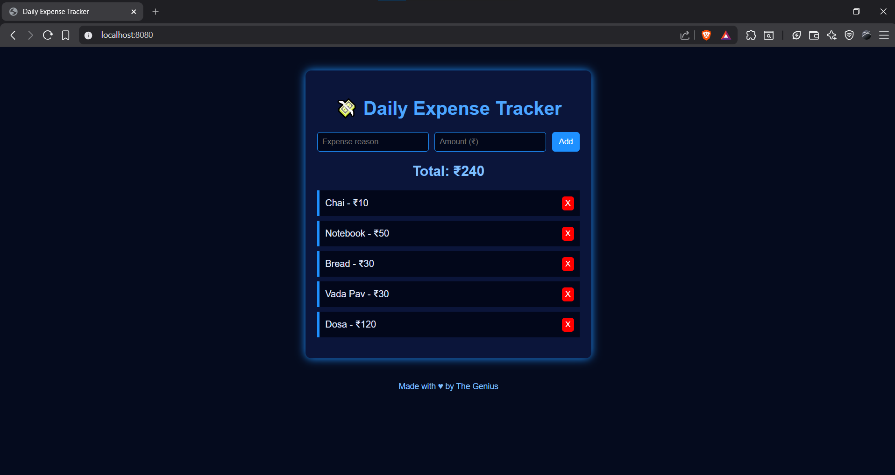

# 💰 Expense Tracker

A simple and clean **Expense Tracker** to record daily expenses, view
spending history, and stay in control of your money. Built with focus on
speed, simplicity, and beginner-friendly design.

------------------------------------------------------------------------

## ❓ Why I Made This

I often forget to write down small daily expenses like tea, snacks,
recharge, etc.\
So I built a simple expense tracker to easily track my daily spending.

------------------------------------------------------------------------

## ✨ Features

-   ➕ Add expenses\
-   🧮 Total amount calculates automatically\
-   💾 Data saved in browser (localStorage)\
-   ❌ Delete expense option\
-   🕒 Basic date & time tracking support\
-   🚀 Lightweight and fast

------------------------------------------------------------------------

## 🛠️ Tech Used

-   🌐 HTML\
-   🎨 CSS\
-   ⚙️ JavaScript (No framework)

------------------------------------------------------------------------

## 🚀 How to Install

1.  Download or clone this repository\
2.  Open the project folder\
3.  Open `index.html` in your browser\
4.  App is ready to use

------------------------------------------------------------------------

## 📖 How to Use

1.  Enter expense reason\
2.  Enter amount\
3.  Click **Add Expense**\
4.  Total updates automatically below\
5.  Use delete button to remove wrong entries

------------------------------------------------------------------------

## 🧩 Problems I Faced

-   Total was not updating initially\
-   Learned localStorage for the first time\
-   Faced index issue in delete button

------------------------------------------------------------------------

## 📚 What I Learned

-   JavaScript DOM manipulation\
-   Real use of localStorage\
-   Basic debugging skills

------------------------------------------------------------------------

## 🔮 Future Improvements

Planned features for future versions:

-   🧾 Receipt printing support\
-   📱 Send expense summary via WhatsApp\
-   🤖 Send notifications on Telegram\
-   📅 Add date to each expense\
-   📊 Monthly filters and analytics\
-   🌙 Dark mode

------------------------------------------------------------------------

## 📸 Screenshot

------------------------------------------------------------------------

## 🙌 Author

**Made with ❤️ Genius**

